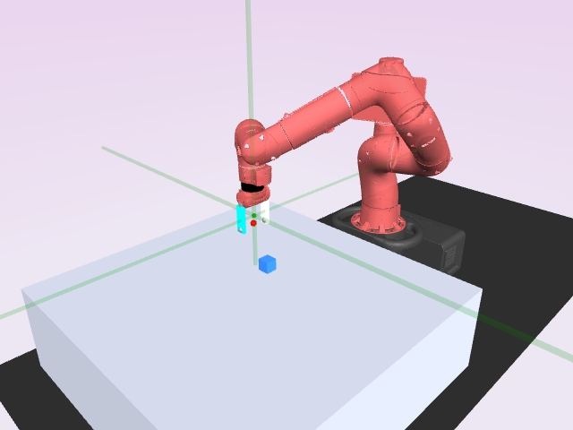
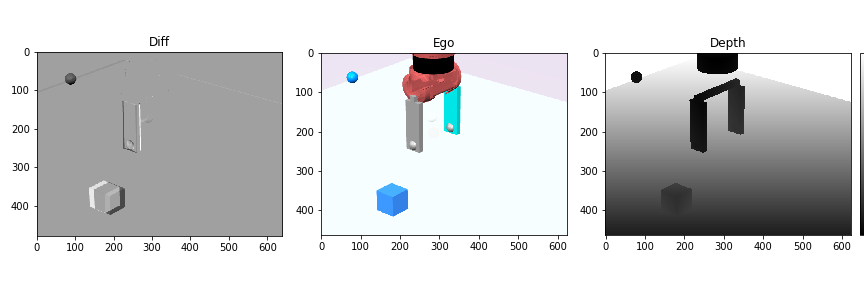

# `gym-Sawyer`, a Sawyer plugin for OpenAI Gym

Current release at `v0.1.0`.

## Installation

Until then: 
```bash
pip install git+https://github.com/geyang/gym-sawyer
```

## Usage Example

```python
import gym

env = gym.make("gym_sawyer:PickPlace-v0", width=84, height=84, cam_id=-1)

env.render("notebook")
```

<p align="center">

</p>



Ge Yang, Bradly Stadie © 2020
