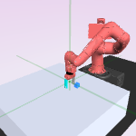
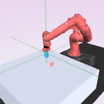
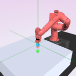
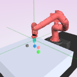

# Sawyer Pick and Place Environment


## Number of Objects
can include 1 - 4 objects:
``` python
for i in range(1, 5):
    env = gym.make("sawyer:PickPlace-v0", cam_id=-1, num_objs=i)
    env.reset()
    img = env.render("glamor", width=150, height=150)
    doc.image(img, src=f"./figures/pick_place_{i}.png", caption=f"{i} block{'s' if i > 1 else ''}")
```
<div style="flex-wrap:wrap; display:flex; flex-direction:row; item-align:center;"><div><div style="text-align: center">1 block</div></div><div><div style="text-align: center">2 blocks</div></div><div><div style="text-align: center">3 blocks</div></div><div><div style="text-align: center">4 blocks</div></div></div>

## Whitebox evaluation of the learned representation:

How well does the learned representation $\phi$ 
predict information such as object location and pose?

Here is our experiment grid:

| Method   |              block   |   arm   |     Comments                                                                                            |
|----------|----------------------|---------|---------------------------------------------------------------------------------------------------------|
| naïve    | None                 | None    | Only the robotic arm is varied a lot&#44; so there is not much variation to the location of the blocks. |