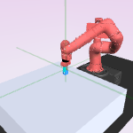
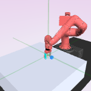
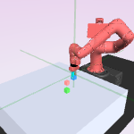
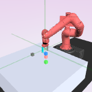

# Sawyer Push Environment

## To-dos

- [ ] simple 1-object pushing domain, show goal image and current 
    camera view
- [ ] make sure that the reward and termination condition are 
    implemented correctly
- [ ] run PPO, Q-learning baselines on this domain, collect
    success rate and final distance to object.

The goal of this environment is to push one of the blocks to the
goal location specified by an image. The representation tend to 
first pick up the arm as opposed to the object. This is because
the arm position varies quite a lot more in the dataset, as it
is actuated directly.

Hence we can consider feature learning as a dataset problem. Model
calibration provides a way for us to understand how a model can
also learn something about the data distribution. Issues to consider
in multi-object vision domains:

1. occlusion
2. not learning the position of the object, due to not having enough
    variation/contrastive loss not picking up
3. the object getting out of the frame.

There are two ways to go forward:
1. VAE
2. calibrated contrastive learning (HDGE)

How do we know that the model is learning the right representations?
1. visualize as in maze?
2. model accuracy?
3. mining hard examples?


## Number of Objects
can include 1 - 4 objects:
``` python
for i in range(1, 5):
    env = gym.make("sawyer:PickPlace-v0", cam_id=-1, num_objs=i)
    env.reset()
    img = env.render("glamor", width=150, height=150)
    doc.image(img, src=f"./figures/pick_place_{i}.png",
              caption=f"{i} block{'s' if i > 1 else ''}")
```
<div style="wrap:wrap; display:flex; flex-direction:row; item-align:center;"><div><div style="text-align: center">1 block</div></div><div><div style="text-align: center">2 blocks</div></div><div><div style="text-align: center">3 blocks</div></div><div><div style="text-align: center">4 blocks</div></div></div>

## Whitebox evaluation of the learned representation:

How well does the learned representation $\phi$ 
predict information such as object location and pose?

Here is our experiment grid:

| Method   |              block   |   arm   |     Comments                                                                                            |
|----------|----------------------|---------|---------------------------------------------------------------------------------------------------------|
| naïve    | None                 | None    | Only the robotic arm is varied a lot&#44; so there is not much variation to the location of the blocks. |
# Sawyer Push Environment

## To-dos

- [ ] simple 1-object pushing domain, show goal image and current 
    camera view
- [ ] make sure that the reward and termination condition are 
    implemented correctly
- [ ] run PPO, Q-learning baselines on this domain, collect
    success rate and final distance to object.

The goal of this environment is to push one of the blocks to the
goal location specified by an image. The representation tend to 
first pick up the arm as opposed to the object. This is because
the arm position varies quite a lot more in the dataset, as it
is actuated directly.

Hence we can consider feature learning as a dataset problem. Model
calibration provides a way for us to understand how a model can
also learn something about the data distribution. Issues to consider
in multi-object vision domains:

1. occlusion
2. not learning the position of the object, due to not having enough
    variation/contrastive loss not picking up
3. the object getting out of the frame.

There are two ways to go forward:
1. VAE
2. calibrated contrastive learning (HDGE)

How do we know that the model is learning the right representations?
1. visualize as in maze?
2. model accuracy?
3. mining hard examples?


## Number of Objects
can include 1 - 4 objects:
``` python
for i in range(1, 5):
    env = gym.make("sawyer:PickPlace-v0", cam_id=-1, num_objs=i)
    env.reset()
    img = env.render("glamor", width=150, height=150)
    doc.image(img, src=f"./figures/pick_place_{i}.png",
              caption=f"{i} block{'s' if i > 1 else ''}")
```
<div style="wrap:wrap; display:flex; flex-direction:row; item-align:center;"><div><div style="text-align: center">1 block</div></div><div><div style="text-align: center">2 blocks</div></div><div><div style="text-align: center">3 blocks</div></div><div><div style="text-align: center">4 blocks</div></div></div>

## Whitebox evaluation of the learned representation:

How well does the learned representation $\phi$ 
predict information such as object location and pose?

Here is our experiment grid:

| Method   |              block   |   arm   |     Comments                                                                                            |
|----------|----------------------|---------|---------------------------------------------------------------------------------------------------------|
| naïve    | None                 | None    | Only the robotic arm is varied a lot&#44; so there is not much variation to the location of the blocks. |
# Sawyer Push Environment

## To-dos

- [ ] simple 1-object pushing domain, show goal image and current 
    camera view
- [ ] make sure that the reward and termination condition are 
    implemented correctly
- [ ] run PPO, Q-learning baselines on this domain, collect
    success rate and final distance to object.

The goal of this environment is to push one of the blocks to the
goal location specified by an image. The representation tend to 
first pick up the arm as opposed to the object. This is because
the arm position varies quite a lot more in the dataset, as it
is actuated directly.

Hence we can consider feature learning as a dataset problem. Model
calibration provides a way for us to understand how a model can
also learn something about the data distribution. Issues to consider
in multi-object vision domains:

1. occlusion
2. not learning the position of the object, due to not having enough
    variation/contrastive loss not picking up
3. the object getting out of the frame.

There are two ways to go forward:
1. VAE
2. calibrated contrastive learning (HDGE)

How do we know that the model is learning the right representations?
1. visualize as in maze?
2. model accuracy?
3. mining hard examples?


## Number of Objects
can include 1 - 4 objects:
``` python
for i in range(1, 5):
    env = gym.make("sawyer:PickPlace-v0", cam_id=-1, num_objs=i)
    env.reset()
    img = env.render("glamor", width=150, height=150)
    doc.image(img, src=f"./figures/pick_place_{i}.png",
              caption=f"{i} block{'s' if i > 1 else ''}")
```
<div style="wrap:wrap; display:flex; flex-direction:row; item-align:center;"><div><div style="text-align: center">1 block</div></div><div><div style="text-align: center">2 blocks</div></div><div><div style="text-align: center">3 blocks</div></div><div><div style="text-align: center">4 blocks</div></div></div>

## Whitebox evaluation of the learned representation:

How well does the learned representation $\phi$ 
predict information such as object location and pose?

Here is our experiment grid:

| Method   |              block   |   arm   |     Comments                                                                                            |
|----------|----------------------|---------|---------------------------------------------------------------------------------------------------------|
| naïve    | None                 | None    | Only the robotic arm is varied a lot&#44; so there is not much variation to the location of the blocks. |
# Sawyer Push Environment

## To-dos

- [ ] simple 1-object pushing domain, show goal image and current 
    camera view
- [ ] make sure that the reward and termination condition are 
    implemented correctly
- [ ] run PPO, Q-learning baselines on this domain, collect
    success rate and final distance to object.

The goal of this environment is to push one of the blocks to the
goal location specified by an image. The representation tend to 
first pick up the arm as opposed to the object. This is because
the arm position varies quite a lot more in the dataset, as it
is actuated directly.

Hence we can consider feature learning as a dataset problem. Model
calibration provides a way for us to understand how a model can
also learn something about the data distribution. Issues to consider
in multi-object vision domains:

1. occlusion
2. not learning the position of the object, due to not having enough
    variation/contrastive loss not picking up
3. the object getting out of the frame.

There are two ways to go forward:
1. VAE
2. calibrated contrastive learning (HDGE)

How do we know that the model is learning the right representations?
1. visualize as in maze?
2. model accuracy?
3. mining hard examples?


## Number of Objects
can include 1 - 4 objects:
``` python
for i in range(1, 5):
    env = gym.make("sawyer:PickPlace-v0", cam_id=-1, num_objs=i)
    env.reset()
    img = env.render("glamor", width=150, height=150)
    doc.image(img, src=f"./figures/pick_place_{i}.png",
              caption=f"{i} block{'s' if i > 1 else ''}")
```
<div style="wrap:wrap; display:flex; flex-direction:row; item-align:center;"><div><div style="text-align: center">1 block</div></div><div><div style="text-align: center">2 blocks</div></div><div><div style="text-align: center">3 blocks</div></div><div><div style="text-align: center">4 blocks</div></div></div>

## Whitebox evaluation of the learned representation:

How well does the learned representation $\phi$ 
predict information such as object location and pose?

Here is our experiment grid:

| Method   |              block   |   arm   |     Comments                                                                                            |
|----------|----------------------|---------|---------------------------------------------------------------------------------------------------------|
| naïve    | None                 | None    | Only the robotic arm is varied a lot&#44; so there is not much variation to the location of the blocks. |