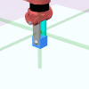

# Sawyer Push Task

# first step is to get PPO with HER to work
# then get TD3 with HER to work. Each should be a couple of hours.

## Top-down View

``` python
env = gym.make('sawyer:Push-v0', cam_id=0, mode="rgb", num_objs=1)
env = GoalImg(env)
obs = env.reset()
doc.image(obs["img"].transpose([1, 2, 0]), "figures/push.png")
doc.print(*obs.keys(), sep=",\n")
```
<div style="flex-wrap:wrap; display:flex; flex-direction:row; item-align:center;"><pre>
hand,
gripper,
obj_0,
x,
goal,
goal_img,
img
</pre>
</div>
