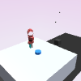
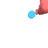

# Sawyer Push Task

This is a simple semi-2D task. We restrict the configuration space
to keep this simple. In the future we can expand this to a larger
configuration space (3D as opposed to 2D).

## To-do

- [x] check if the config are minimal (standardize)
- [x] implement view
- [x] implement reward

## Standard push environment

``` python
env = gym.make('sawyer:Push-v0', )
env = GoalImg(env)
env.seed(100)
obs = env.reset()
doc.image(obs['img'].transpose([1, 2, 0]), "figures/push_standard.png", caption="Agent View")
doc.image(obs['goal_img'].transpose([1, 2, 0]), "figures/push_standard_goal.png", caption="Goal Image")
```
<div style="flex-wrap:wrap; display:flex; flex-direction:row; item-align:center;"><div><div style="text-align: center">Agent View</div></div><div><div style="text-align: center">Goal Image</div></div></div>

There are three camera views:

| `cam_id`   |  Description         |
|------------|----------------------|
| `-1`       | human view           |
| `0`        | gripper-centric view |
| `1`        | Top-down view        |
## Canonical View (`cam_id == -1`)

``` python
env = gym.make('sawyer:Push-v0', cam_id=-1, mode="rgb", num_objs=2)
env = GoalImg(env)
obs = env.reset()
img = env.render('glamor', width=640, height=240)
doc.image(img, "figures/push_glamor.png")
```
<div style="flex-wrap:wrap; display:flex; flex-direction:row; item-align:center;"></div>

## All Views (`cam_id == 0`)

This view watched down from above.

``` python
for cam_id in [-1, 0, 1]:
    env = gym.make('sawyer:Push-v0', cam_id=cam_id)
    env = GoalImg(env)
    obs = env.reset()
    doc.image(obs["img"].transpose([1, 2, 0]), f"figures/push_{cam_id}.png", caption=f"cam_id={cam_id}")
```
<div style="flex-wrap:wrap; display:flex; flex-direction:row; item-align:center;"><div><div style="text-align: center">cam_id=-1</div></div><div><div style="text-align: center">cam_id=0</div></div><div><div style="text-align: center">cam_id=1</div></div></div>

## Distribution of blocks

This view watched down from above.

``` python
import numpy as np

env = gym.make('sawyer:Push-v0', num_objs=1)
env = GoalImg(env)
images = []
for i in trange(10):
    obs = env.reset()
    images.append(obs['img'])

doc.image(np.array(images).min(0).transpose([1, 2, 0]), f"figures/push_rho_0.png", caption="Distribution")
doc.image(obs['goal_img'].transpose([1, 2, 0]), f"figures/push_goal.png", caption="Goal Image")
```
<div style="flex-wrap:wrap; display:flex; flex-direction:row; item-align:center;"><div><div style="text-align: center">Distribution</div></div><div><div style="text-align: center">Goal Image</div></div></div>
