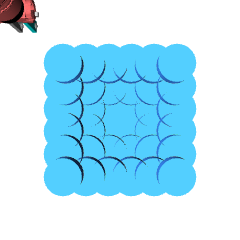

# Sawyer Push Task (Core Dataset)

Here we show the range of movement that the arm and the
puck are allowed. The puck moves within a 30x30 $cm^2$ 
area, whereas the arm has an extra padding of 10 cm on 
each side, allowing it to move to the side.

We might consider restricting the distribution of the puck (make it smaller) to reduce samplle complexity. Look at LEAP and see how big a configuration space they used as a baseline.

``` python
the_grid = np.array([[x, y, 0.06] for x in np.linspace(-0.15, 0.15, 6) for y in np.linspace(0.35, 0.65, 6)])
env = gym.make('sawyer:Push-v0', cam_id=0, width=240, height=240)
env = GoalImg(env)
env.seed(100)
i = 0
all_images = []
for obj_pos in tqdm(the_grid[:], desc="iterrating through the grid"):
    obs = env.reset_model(x_kwargs=dict(obj_pos=obj_pos, hand_pos=(-0.25, 0.25, 0.06)))
    all_images.append(obs['img'].transpose([1, 2, 0]))

doc.image(np.array(all_images).min(axis=0), f"figures/core-set/overlay.png", caption=f"")
```
<div style="flex-wrap:wrap; display:flex; flex-direction:row; item-align:center;"><div><div style="text-align: center"></div></div></div>
